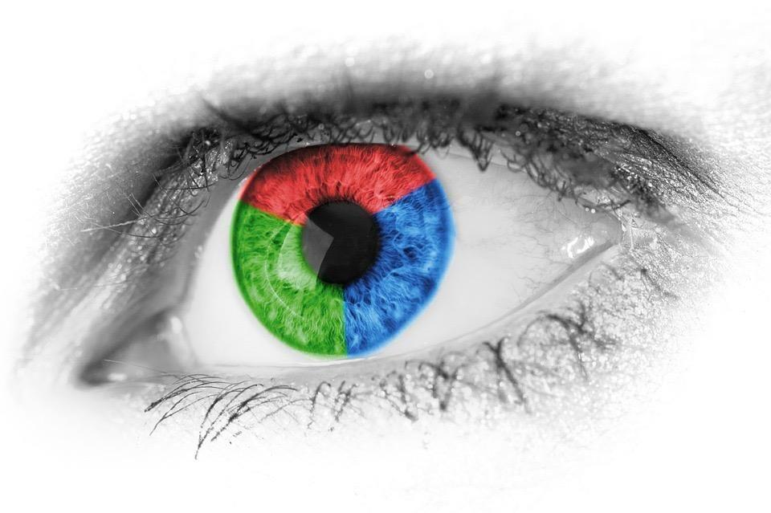

## 17. 如果你有一个很大的开发集，将它分成两个，而且你只看一个

假设你有一个5000个样本的大型开发集，其中识别错误率是20%。因此，你的算法大约误分类了1000个样本。手动检查1000个样本需要花很长时间，因此我们可能决定在错误分析中不使用全部误分类的图像。

在这种情况下，我会明确的将开发集分成两个子集，其中有一个是你要看的，另一个是你不看的。你将更快的过拟合完手动查看的部分。你可以使用手动查看的部分来调整参数。

让我们继续上面的例子，其中算法对5000个开发集样本中的1000个进行了误分类。假设我们要手动检查大约100个错误样本用于错误分析（10%的错误）。你应当随机选择10%的开发集，并将其放入我们称为**眼球开发集（Eyeball dev set）**中，以便我们使用研究来观察。（对于语音识别，你可以将会听音频片段，也许你可以称之为耳朵开发集）。因此，眼球开发集有500个例子，其中我们的算法误分类的个数的期望值是100。

开发集的第二个子集，称为**黑盒开发集（Blackbox dev set）**, 将会拥有4500个样本。你可以用黑盒开发集通过测量误差率自动评估分类器。你可以使用它来调整算法或调整超参数。但是，你应该避免用眼睛看它。我们使用术语“黑盒子（Blackbox），因为我们只会使用这个数据自己来获得分类器的黑盒子评估。

为什么我们明确将开发集分成眼球和黑盒开发集？既然你会直观的了解眼球开发集中的样本，你就会开始更快的过拟合眼球开发集。若果你发现眼球开发集比黑盒开发集性能提升的更快，那么你已经过拟合眼球开发集了。在这种情况下，你可能需要放弃它，并通过转移更多黑盒开发集中的样本到眼球开发集或获取新的标签数据集。

将你的开发集明确的拆分成眼球和黑盒开发集，可以让你知道手动分析错误过程中何时过拟合了眼球开发集部分的数据。

